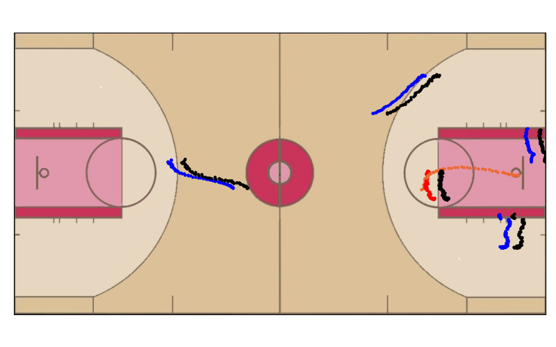

# PlayBest: Professional Basketball Player Behavior Synthesis via Planning with Diffusion
PlayBest: Professional Basketball Player Behavior Synthesis via Planning with Diffusion

This repository contains the source code and datasets for [PlayBest: Professional Basketball Player Behavior Synthesis via Planning with Diffusion](https://arxiv.org/pdf/2306.04090).

## Links

- [Requirements](#requirements)
- [Overview](#overview)
- [Data](#data)
- [Training](#training)
- [Plan Guided](#plan-guided)
- [Generate Gifs](#generate-gifs)
- [Generate Snapshots](#generate-snapshots)
- [Citations](#citations)

## Requirements

The code is written in Python 3.8.15 Before running, you need to first install the required packages by typing following commands (Using a virtual environment is recommended):

```
conda env create -f environment.yml
```

## Overview
**PLAYBEST** (Professional Basketball Player Behavior Synthesis via Planning with Diffusion) is a method for generating optimal, realistic basketball player trajectories using a diffusion probabilistic model. The framework tackles the complexity of decision-making in basketball by framing the process as a conditional trajectory generation task, informed by player motion tracking data from NBA games. PlayBest extends traditional diffusion models by incorporating a value function that guides the generation process, allowing for reward-based optimization of player strategies. This enables PlayBest to adaptively synthesize realistic basketball plays that align with professional tactics. Simulation studies confirm that the generated trajectories produce effective plays, demonstrating the model's ability to capture the nuanced dynamics of basketball games and outperform traditional methods in flexibility and adaptability.

<p align="center">
  
</p>

## Data

### Downloading Trajectories

```bash

```

### Downloading Rewards

```bash

```

## Training
```
CUDA_VISIBLE_DEVICES=2 python scripts/train.py --dataset basketball_single_game_wd --n_diffusion_steps 30 --action_weight 30 --ema_decay 0.996 --learning_rate 0.002 --savepath act30lre3 > "trainingoutput_act30lre3.log" 2>&1 
```
Parameters can be found in [locomotion.py](config/locomotion.py), above is an example.

The best Hyperparameters found in our study can be found [here](./Best_Hyper_Params.json).

## Plan Guided

```
CUDA_VISIBLE_DEVICES=6 python ./scripts/plan_guided.py --dataset basketball_single_game_wd_act --logbase /logs/ --diffusion_epoch epoch_50
```
Specify the dataset, logbase, and optionally load a specific trained model (default is max epoch checkpoint)

## Generate Gifs
Make sure you are in the full_viz_pipeline directory before running the following command:
```
python full_visual_pipeline.py --path ./logs/"guided_samples_test_cond100_0.1"/2016.NBA.Raw.SportVU.Game.Logs12.05.2015.POR.at.MIN_dir-1-guided-245K.npy
```

## Generate Snapshots
Make sure you are in the full_viz_pipeline directory before running the following command:
```
python NBA-Player-Movements/shooter_png_dir/visual_2d.py guided_samplesact_(2_3)_50100_0.1/2016.NBA.Raw.SportVU.Game.Logs12.05.2015.POR.at.MIN_dir-15-guided-245K -1 233 300 3
```
First give the relative path to the possession you are looking at.
The numbers following the command represent:
- Selection of the 5 trials for the given possession
- Start frame
- End frame
- Shooter player number

<p align="center">
  
</p>

## Citations

Please cite the following paper if you find this repo helpful for your research.
```
@article{chen2024playbestprofessionalbasketballplayer,
  title={PlayBest: Professional Basketball Player Behavior Synthesis via Planning with Diffusion}, 
  author={Chen, Xiusi and Wang, Wei-Yao and Hu, Ziniu and Reynoso, David and Jin, Kun and Liu, Mingyan and Brantingham, P. Jeffrey and Wang, Wei},
  year={2024},
  eprint={2306.04090},
  archivePrefix={arXiv},
  primaryClass={cs.AI},
  url={https://arxiv.org/abs/2306.04090}
}
```